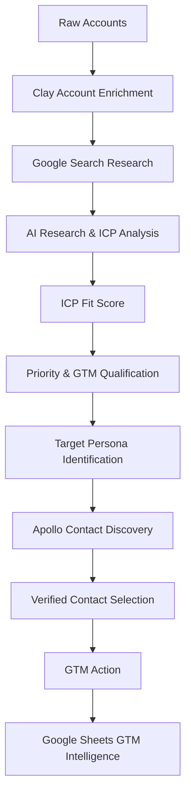
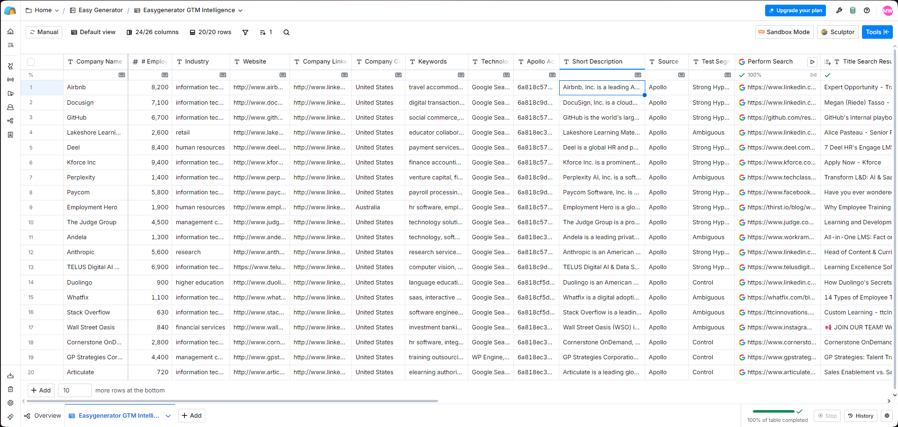
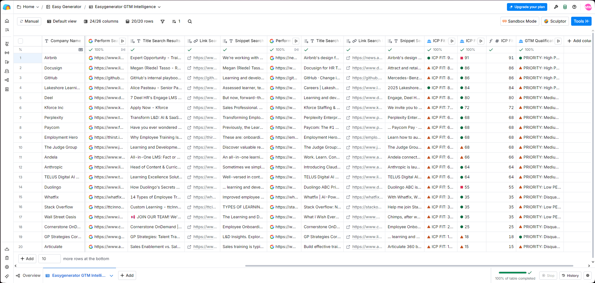
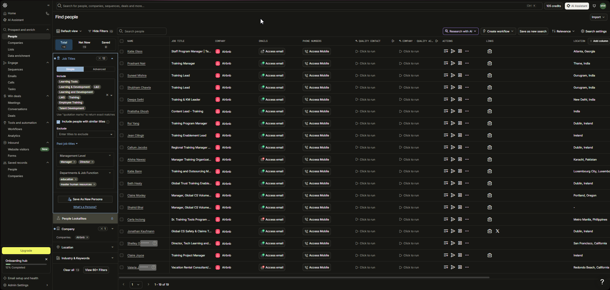
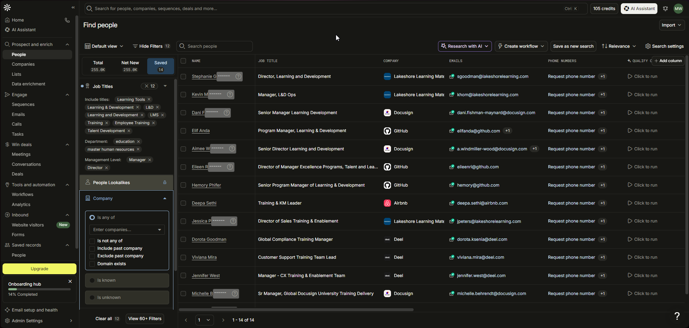
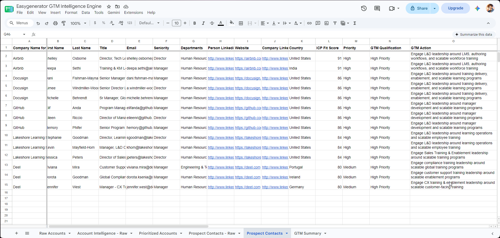
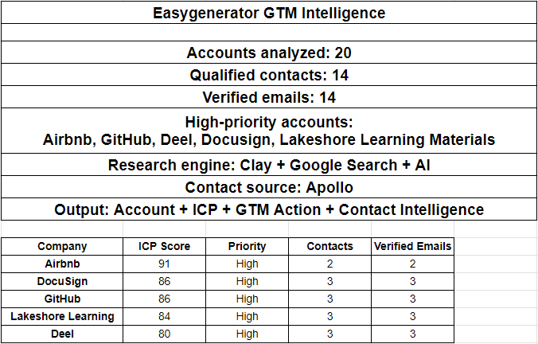
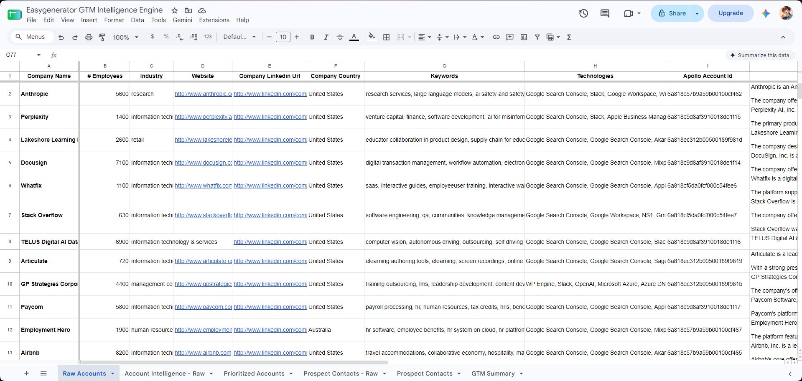

# Easygenerator GTM Intelligence Engine

> An AI-powered GTM intelligence pipeline designed for Easygenerator to identify high-fit accounts, prioritize prospects, discover relevant buying personas, and turn account research into actionable outreach intelligence.

## Overview

The **Easygenerator GTM Intelligence Engine** is a practical GTM Engineering project built around a real-world account research and prospecting workflow.

The goal was to move beyond a traditional lead list and build a repeatable process that answers:

- Which accounts are the strongest ICP fits?
- Why does an account fit the ICP?
- Which accounts should GTM teams prioritize?
- Which people inside those accounts are relevant prospects?
- Which contacts have verified email addresses?
- What GTM action should be taken for each prospect?

The workflow combines **Clay, Google Search, AI analysis, Apollo, and Google Sheets** to transform raw account data into prioritized account and contact intelligence.

---

## The Problem

Traditional prospecting often produces large lists of companies and contacts without enough context to determine who should actually be contacted.

A GTM team needs more than:

> Company → Contact → Email

It needs:

> **Account → Research Signals → ICP Fit → Priority → Persona → Contact → GTM Action**

This project was built to demonstrate how a GTM Engineer can connect research, enrichment, AI, prospecting, and structured outputs into one workflow.

---

## Solution

The pipeline processes a defined account list and progressively enriches it through multiple stages:



---

# GTM Workflow

## 1. Account Research & Enrichment

The initial account dataset was enriched using **Clay**.

Account-level information included:

- Company name
- Employee count
- Industry
- Website
- Company LinkedIn URL
- Company country
- Keywords
- Technologies
- Apollo account ID
- Company description
- Research sources

The goal was to establish enough account context before applying ICP qualification.



---

## 2. Research & ICP Qualification

The enriched accounts were researched using **Google Search through Clay**.

Research signals were used to understand:

- Learning and development initiatives
- Training activity
- Employee enablement
- LMS and learning technology signals
- Relevant job opportunities
- Company-specific learning or training initiatives
- Potential buying signals

AI was then used to turn these research signals into structured GTM intelligence.

The output included:

- ICP Fit Score
- Priority
- GTM Qualification
- Reasoning
- Recommended next action



---

## 3. ICP Fit Scoring

Each account received an **ICP Fit Score from 0–100**.

The score was then converted into a numeric field so accounts could be sorted and prioritized.

Example prioritization:

| Account                      | ICP Score | Priority |
| ---------------------------- | --------: | -------- |
| Airbnb                       |        91 | High     |
| DocuSign                     |        86 | High     |
| GitHub                       |        86 | High     |
| Lakeshore Learning Materials |        84 | High     |
| Deel                         |        80 | Medium   |

This allowed the workflow to move from broad account research to a focused set of accounts worth deeper prospecting.

---

## 4. Contact Discovery

After identifying high-priority accounts, **Apollo** was used to find people whose roles aligned with the identified GTM personas.

The search focused on relevant functions and titles around:

- Learning & Development
- Learning Operations
- Training
- Employee Training
- Talent Development
- Enablement
- Customer Support Training
- Training Leadership

The objective was not simply to find contacts, but to find **contacts whose responsibilities aligned with the account-level buying signals**.



---

## 5. Qualified Contact Selection

Relevant contacts were reviewed and selected based on:

- Role relevance
- Seniority
- Department
- Account priority
- Persona alignment
- Email availability

The final prospecting dataset contained:

**14 qualified contacts with verified emails.**



---

# 6. Prospect-Level GTM Intelligence

The selected contacts were exported into Google Sheets and enriched with the account intelligence generated earlier.

The final prospect dataset combines:

- Company
- First name
- Last name
- Title
- Email
- Seniority
- Department
- LinkedIn
- Website
- Company LinkedIn
- Country
- ICP Fit Score
- Priority
- GTM Qualification
- GTM Action

This creates a single working dataset that connects **account intelligence with contact intelligence**.



---

## 7. GTM Actions

Each qualified prospect receives a specific GTM action based on their role and the account's identified signals.

Examples include:

- Engage L&D leadership around LMS, authoring workflows, and scalable workforce training
- Engage L&D leadership around training delivery, enablement, and scalable learning programs
- Engage manager development and scalable learning programs
- Engage learning operations and scalable employee training
- Engage Sales Training & Enablement leadership around scalable training programs
- Engage compliance training leadership around scalable global training programs
- Engage customer support training leadership around scalable training programs
- Engage CX training & enablement leadership around scalable customer-facing training

This transforms research into a **next-action recommendation**, rather than leaving the GTM team with a static list.

---

# 8. GTM Summary

The final Google Sheets summary provides a high-level view of the pipeline output.

### Project Results

| Metric                 | Result |
| ---------------------- | -----: |
| Accounts analyzed      |     20 |
| Qualified contacts     |     14 |
| Verified emails        |     14 |
| High-priority accounts |      5 |

### High-Priority Accounts

- Airbnb — ICP Score: 91
- DocuSign — ICP Score: 86
- GitHub — ICP Score: 86
- Lakeshore Learning Materials — ICP Score: 84
- Deel — ICP Score: 80



---

# System Architecture

```mermaid
    flowchart LR
    A[Raw Accounts]

    subgraph RESEARCH["Research & Enrichment"]
        B[Clay]
        C[Google Search]
        D[AI Analysis]
    end

    subgraph QUALIFICATION["Account Qualification"]
        E[ICP Fit Score]
        F[Priority]
        G[GTM Qualification]
    end

    subgraph PROSPECTING["Contact Discovery"]
        H[Apollo]
        I[Qualified Contacts]
        J[Verified Emails]
    end

    subgraph OUTPUT["GTM Intelligence"]
        K[Google Sheets]
        L[GTM Actions]
        M[GTM Summary]
    end

    A --> B
    B --> C
    C --> D
    D --> E
    E --> F
    F --> G
    G --> H
    H --> I
    I --> J
    J --> K
    K --> L
    L --> M
```





---

# Tech Stack

| Tool              | Purpose                                                                                 |
| ----------------- | --------------------------------------------------------------------------------------- |
| **Clay**          | Account enrichment, research orchestration, search, and AI-powered data transformation  |
| **Google Search** | Account and buying-signal research                                                      |
| **AI**            | Research interpretation, ICP scoring, qualification, reasoning, and GTM recommendations |
| **Apollo**        | Contact discovery and email enrichment                                                  |
| **Google Sheets** | Structured GTM output, prospect management, and reporting                               |

---

# Data Model

The workflow produces two major intelligence layers.

### Account Intelligence

```text
Company
├── Firmographic Data
├── Industry
├── Technologies
├── Keywords
├── Research Signals
├── ICP Fit Score
├── Priority
├── GTM Qualification
├── Reasoning
└── Recommended Action
```

### Contact Intelligence

```text
Contact
├── Name
├── Title
├── Seniority
├── Department
├── Email
├── LinkedIn
├── Company
├── ICP Fit Score
├── Priority
├── GTM Qualification
└── GTM Action
```

---

# What Makes This a GTM Engineering Project?

This project demonstrates the ability to connect multiple GTM systems into a structured workflow rather than using each tool independently.

### 1. Research Engineering

Account research was converted into structured data instead of remaining as unstructured notes.

### 2. Signal-Based Qualification

Research signals were used to determine whether an account represented a meaningful ICP opportunity.

### 3. AI-Assisted Decision Making

AI was used to interpret research and generate structured qualification outputs.

### 4. Account Prioritization

ICP scoring transformed a broad account list into a prioritized GTM target list.

### 5. Persona-Based Prospecting

Contact discovery was based on the buying personas and signals identified during account research.

### 6. Actionable Outputs

The final output does not stop at identifying prospects. Each qualified contact receives a recommended GTM action.

---

# Key Outcomes

The completed workflow produced:

- **20 researched accounts**
- **14 qualified contacts**
- **14 verified emails**
- **5 high-priority accounts**
- Account-level ICP scoring
- Account prioritization
- Persona-based contact discovery
- Prospect-level GTM actions
- A consolidated GTM intelligence workspace in Google Sheets

The result is a repeatable workflow for turning account research into **prioritized, actionable prospecting intelligence**.

---

# Repository Structure

```text
easygenerator-gtm-intelligence-engine/
│
├── docs/
│   └── screenshots/
│       ├── 01_clay_account_enrichment.png
│       ├── 02_clay_research_and_scoring.png
│       ├── 03_apollo_contact_discovery.png
│       ├── 04_apollo_qualified_contacts.png
│       ├── 05_prospect_contact_intelligence.png
│       ├── 06_gtm_summary_dashboard.png
│       └── 07_gtm_pipeline_overview.png
│
├── README.md
└── ...
```

---

# Limitations

This project is intentionally focused on demonstrating the core GTM intelligence workflow.

The current version does not include:

- Automated outbound sequencing
- Automated email personalization at scale
- CRM synchronization
- Automated lead routing
- Continuous account monitoring
- Automated intent signal monitoring
- Closed-loop campaign performance analysis

These would be natural extensions of the system in a production GTM environment.

---

# Future Improvements

A production-ready version could extend the workflow with:

### CRM Integration

Automatically push qualified accounts and contacts into a CRM such as HubSpot or Salesforce.

### Automated Outreach

Generate personalized messaging based on:

```text
Account Signal
+
Persona
+
Role
+
Pain Point
+
Recommended GTM Action
```

### Lead Routing

Automatically route high-priority prospects to the appropriate sales owner.

### Continuous Monitoring

Monitor accounts for new signals such as:

- New L&D leadership
- New training initiatives
- New LMS-related roles
- Expansion
- Hiring activity
- Relevant company announcements

### Closed-Loop GTM Intelligence

Connect outreach and engagement outcomes back to the qualification model to continuously improve prioritization.

---

# Project Takeaway

The core principle behind this project is:

> **Good GTM data is not just about finding more prospects. It is about identifying the right prospects, understanding why they matter, and determining what to do next.**

The Easygenerator GTM Intelligence Engine demonstrates how a GTM Engineer can combine **data enrichment, web research, AI, prospecting infrastructure, and structured outputs** to create a practical account-to-contact intelligence workflow.

---

## Built With

**Clay · Google Search · AI · Apollo · Google Sheets**

**Project:** Easygenerator GTM Intelligence Engine  
**Focus:** GTM Engineering · Account Intelligence · ICP Qualification · Prospecting · Sales Intelligence

**Built with ❤️ by Gemm💎**
